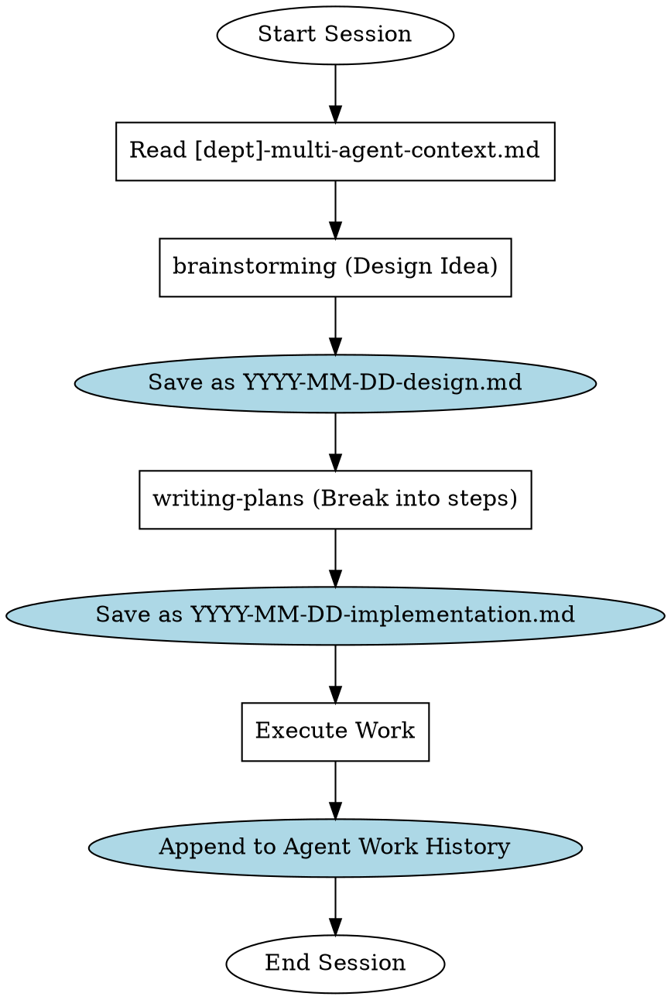

# Managing Project Documentation

## Overview

**managing-project-documentation IS the nervous system of multi-agent development.**

When multiple AI agents work on the same codebase across different sessions, context is easily lost. This skill enforces a STRICT, scalable, department-based documentation architecture. Instead of dumping arbitrary `plan.md` files in the root folder, all planning, context-sharing, and technical documentation MUST reside within structured departmental subdirectories under `docs/plans/`. 

Crucially, you are managing the **living history of the project**. This skill dictates how you read the past, document the present, and plan the future.

**REQUIRED BACKGROUND:** This skill is the storage/context backbone that works in tandem with `brainstorming` (for generating ideas) and `writing-plans` (for breaking ideas into tasks).

## When to Use

- **Starting a new session:** You need to know what happened before you got here.
- **Project Initialisation:** Scaffold the documentation for a new feature or department.
- **Handoff / Ending a Session:** Saving your context, logic, and state for the next AI agent.
- **Architecting Features:** Saving the output of a `brainstorming` session.
- **Task Breakdown:** Serving as the destination path for `writing-plans`.

## Core Architecture: The Department Structure

All documentation happens in `docs/plans/`. It must be structured by "departments" or logical modules. Example departments: `admin_panel`, `zakatul_fitr`, `main`, `general`.

```
docs/plans/
  [department_name]/
    [department]-main-goals.md                  # Overarching business logic
    [department]-multi-agent-context.md         # Active technical context & IMMORTAL history log
    YYYY-MM-DD-feature-design.md                # Timestamped technical implementation plans
```

### 1. `[department]-main-goals.md`
- **What it is:** High-level business and product objectives.
- **Rules:** Rarely changes after the initial formulation. Keep it non-technical. Do not put code snippets here.
- **Example:** See `examples/main-goals.md`

### 2. `[department]-multi-agent-context.md` (The Critical Bridge)
- **What it is:** The absolute "source of truth" bridging gaps across AI sessions. 
- **What it contains:** 
  1. **Current Phase:** What is the active goal?
  2. **Core Technical Patterns:** DB schemas, routing paradigms, auth mechanisms (so future agents don't break them).
  3. **Agent Work History:** An array/list of chronological updates.
- **THE IRON LAW:** You may NEVER delete or overwrite past array entries in the Work History. You must exclusively **APPEND** new logs to the top of the list. History is immutable.
- **Example:** See `examples/multi-agent-context.md`

### 3. Timestamped Design Docs (`YYYY-MM-DD-feature-.md`)
- **What it is:** Specific, deep-dive implementation plans or design specs.
- **Workflow:** When using the `brainstorming` skill, the resulting design doc gets saved here. When using the `writing-plans` skill, the step-by-step implementation plan gets saved here.
- **Example:** See `examples/feature-design.md`

## Workflow Integration Flowchart

How this skill interacts with your other superpowers:



## The Red Flags - STOP AND CORRECT COURSE

Agents will rationalize taking shortcuts. Do not fall into these traps.

| Red Flag (The Excuse) | The Reality / The Fix |
|-----------------------|-----------------------|
| 🚩 "I'll just make a `plan.md` in the root folder, it's a small task." | **Delete it.** Everything goes in `docs/plans/[dept]/`. Small tasks still need context tracking. |
| 🚩 "The work history in the context file is getting too long. I'll summarize and delete older entries." | **Revert immediately.** History is immutable. You are destroying audit trails. Only APPEND. |
| 🚩 "I'll just add my code snippets and database schema to `main-goals.md`." | **Move them.** `main-goals.md` is for business logic. Tech specs go in `multi-agent-context.md` or timestamped design docs. |
| 🚩 "I finished my task, I'll just tell the user I'm done." | **Incomplete!** You MUST append your actions to the `multi-agent-context.md` work history before terminating. |

## The "Handoff" Protocol (Checklist)

Whenever you are about to say "Task Complete" or end a session, you MUST:

1. Open the relevant `docs/plans/[department]/[department]-multi-agent-context.md`.
2. Locate the `## Agent Work History` section.
3. Add a new bullet point at the top with today's date (`YYYY-MM-DD`).
4. Concisely list:
   - What feature you built / bug you fixed.
   - What fundamental architectural changes you made (e.g. "Switched from Client-side state to Server Actions").
   - Any new dependencies or core files added.
5. Save the file and explicitly tell the human partner you have updated the Multi-Agent Context.
